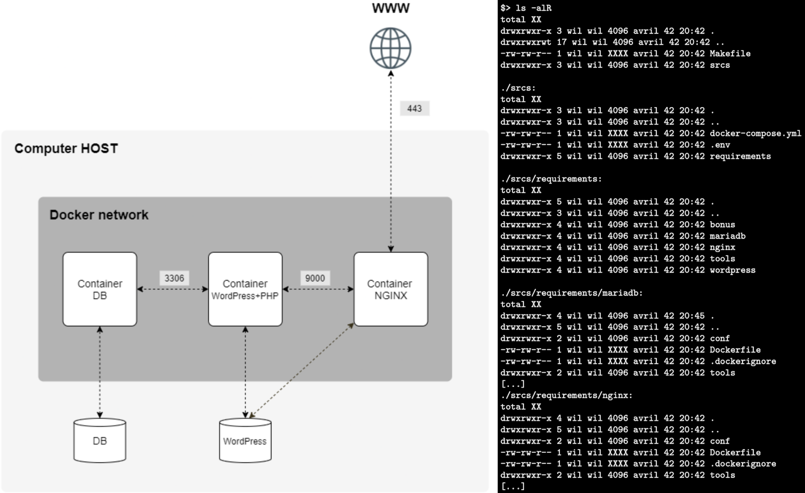

# Inception - 42

**This project from 42 school aims to broaden your knowledge of system administration by using Docker. In this tutorial you will virtualize several Docker images, creating them in your new personal virtual machine.**

## Virtual Machine

As this project has to be done within a VM, a 64-bit Debian VM has been created with the use of VirtualBox software.

VM **hardware characteristics**:

-   amd64 Debian ISO (Optical Disk Image).
    
-   4 GB fixed RAM memory.
    
-   14 GB VDI (Virtual Desktop Infrastructure) stored in sgoinfre/students/acaravan/Virtualbox.
    
-   Use 4 cores from the base machine.

VM **credentials**:

-   VM name: Inception
    
-   Domain name: acaravan
    
-   Superuser password: *************


-   New user name: Alberto Caravantes
    
-   Username for new user: acaravan42
    
-   Password for new user: *************

First step is to add the new user to the sudo group.

````bash
# To add username to sudo group (from root).
sudo  usermod  -aG  sudo  <username>

# To check the groups the user belongs to.
groups  <username>
````

**SSH** must be installed to connect to the VM through the base computer terminal or VS Code.

```bash
sudo  apt  install  openssh-server
```

Also, in order to define the ports through which SSH connection will be established, the /etc/ssh/sshd_config file must be edited (nano if vim is not installed yet).

In the sshd_config file, change Port 22 (i.e. for Port 4242).

**UFW** (Uncomplicated FireWall) should also be installed and configured.

````bash
sudo apt  install  ufw

# To check if it is already enabled
ufw status

# To enable ufw
ufw enable

# To enable the desired port (i.e. 4242)
ufw allow 4242

# Reveals the allowed ports.
ufw status numbered

# If a port needs to be deleted.
ufw delete <port_index>

````
In order to establish a connection through the VS Code Remote Explorer extension using SSH, the VM network configuration should be set to NAT instead of Bridged Adapter.

Also, from the same config page, in “Advanced”, 4242 port should be forwarded as seen in the following image:


If all of this has been configured correctly, the VM should be ready to have Docker installed as explained in the following Docker docs webpage: https://docs.docker.com/engine/install/debian/

## Docker

As specified in the project’s subject, this is the Docker structure to build (left) and the corresponding project directory structure (right):



Here, we find the ports that will allow WordPress to communicate internally with the database (to be able to store new pages or others), and NGINX which communicates with WordPress (which will tell it what to display on the web server).

The MariaDB container stores its information(database)in the corresponding volume and WordPress (wordpress website) on its own volume.

The whole Docker structure should be built and run with a single Makefile. This Makefile calls the docker compose command specifying the docker-compose.yml file.

Each of the three containers to build (mariadb, wordpress and nginx) has its own Dockerfile in its own directory inside requirements directory (i.e. srcs/requirements/nginx/Dockerfile).

### Docker Compose

Docker Compose is a tool for defining and running multi-container Docker applications. It allows you to define an entire application stack, including the services, networks, and volumes, in a single file called “docker-compose.yml”.

The objective is to create a service for each container (mariadb, wordpress and nginx), as well as specify the network to which it belongs and the associated volume(s).

````
version: '3'

services:

	mariadb:
		container_name: mariadb
		build: ./requirements/mariadb
		env_file: .env
		restart: on-failure
		volumes:
			- mariadb-data:/var/lib/mysql
		networks:
			- inception
	nginx:
		container_name: nginx
		build: ./requirements/nginx
		env_file: .env
		restart: on-failure
		depends_on:
			- wordpress
		ports:
			- 443:443
			- 9000
		volumes:
			- wordpress-data:/var/www/wordpress
		networks:
			- inception

	wordpress:
		container_name: wordpress
		build: ./requirements/wordpress
		env_file: .env
		restart: on-failure
		depends_on:
			- mariadb
		ports:
			- 9000
		volumes:
			- wordpress-data:/var/www/wordpress
		networks:
			- inception

	volumes:
		mariadb-data:
			driver: local
		wordpress-data:
			driver: local

networks:
	inception:
		name: inception
````

### Dockerfile

The Dockerfile is a text file that contains instructions for building a Docker image. It provides a set of commands and configurations to specify how the Docker image should be created. Docker uses these instructions to automate the process of building a containerized application. The Dockerfile typically includes details such as the base image, required dependencies, environment variables, and commands to set up the application within the container.

The following code snippet shows the Dockerfile for building the NGINX container.

````
#  Build  from  penultimate  stable  Debian  version  (bullseye)  image.

FROM  debian:bullseye

RUN  apt  update  -y  &&  \
	apt  upgrade  -y  &&  \
	apt  install  nginx  -y  &&  \
	apt  install  openssl  -y

RUN  mkdir  -p  /etc/nginx/ssl

#  Configure  openssl  (SSL  -  Secure  Sockets  Layer).
#  -  "req"  with  "-x509"  generates  a  self-signed  certificate.
#  -  "-nodes"  indicates  not  to  encrypt  the  private  key  with  a  passphrase  and  store
#  it  in  plain  text.
#  -  "-days"  specifies  the  number  of  days  that  the  certificate  will  be  valird  for.
#  -  "-newkey"  with  "-rsa:2048"  specifies  that  a  new  RSA  private  key  should  be
#  generated  (with  a  length  of  256  bits).
#  -  "-keyout"  specifies  where  the  private  key  should  be  stored.
#  -  "-out"  specifies  where  the  certificate  should  be  stored.
#  -  "-subj"  specifies  the  subject  of  the  certificate.

RUN  openssl  req  -newkey  rsa:4096  -x509  -sha256  -days  365  -nodes  \
	-out  /etc/nginx/ssl/acaravan.crt  \
	-keyout  /etc/nginx/ssl/acaravan.key  \
	-subj  "/C=ES/ST=Spain/L=Spain/O=42  School/OU=acaravan/CN=acaravan/"

#  Configure  NGINX
RUN  mkdir  -p  /run/nginx
COPY  ./conf/nginx.conf  /etc/nginx/conf.d/

#  COPY  ./tools/index.html  /var/www/html/index.html

EXPOSE  443

#  Daemon  off  to  make  NGINX  process  run  in  foreground  and  stay  connected  to  the
#  terminal.
ENTRYPOINT  [  "nginx",  "-g",  "daemon  off;"  ]
````

### What is a docker network?

You can create custom, user-defined networks, and connect multiple containers to the same network. Once connected to a user-defined network, containers can communicate with each other using container IP addresses or container names.

In the following code snippet from a docker-compose.yml file, a custom user-defined network named “inception” is created. The type of network it implements is a user-defined bridge network.

A bridge network is the default network type when connecting containers. Containers on the same bridge network can communicate with each other. This is commonly used for connecting multiple containers on a single host.

### Useful Docker commands

Each docker command begins with the keyword “docker”. Also, docker needs sudo privileges to be executed.

````
# To build a single docker container from a Dockerfile.
sudo docker build <path_to_dockerfile>

# A container name can also be specified using -t flag.
sudo docker  build  -t  <container_name>  <path_to_dockerfile>

# To list all currently built images.
sudo docker  image  ls

# To run an already built image.
sudo docker run <image_name>

# To access the container terminal using bash.
sudo docker exec -it <container_name> /bin/bash

# To list all the running containers.
sudo docker ps

# To start docker containers, rebuilding the images.
sudo docker compose -f <path_to_docker-compose.yml> up --build

# To  retrieve  detailed  information  about  a  Docker  network.
sudo docker  network  inspect  inception
````

## Inception infrastructure

As stated before, 3 containers, 2 volumes and 1 network are implemented.

  

-   NGINX container (with TLS v1.2 or TLS v1.3).

-   WordPress container (with PHP-FPM configured)
    
-   MariaDB container (without NGINX)
    
-   Volume containing wordpress database.
    
-   Volume containing files of the wordpress site.

-   1 bridge network connecting all 3 containers (inception network).

### Some considerations

Volumes must be available from the /home/<login>/data host machine folder using Docker.

Wordpress database must contain 2 different users: an admin (that should not be called admin), and a second standard user.

For readability reasons, a domain name will be configured so that it points to our local IP address . This domain name will be <login>.42.fr

Also, the use of environment variables is mandatory. A hidden .env file must be located in ./srcs directory, for example:

````
DOMAIN_NAME=wil.42.fr

#  certificates
CERTS_=./XXXXXXXXX

#  MYSQL  SETUP
MYSQL_ROOT_PASSWORD=XXXXXXXXXX
MYSQL_USER=XXXXXXXXXX
MYSQL_PASSWORD=XXXXXXXXXX

[...]
````

Finally, it is important to note that the NGINX container must be the only entrypoint to the infrastructure through port 443 only using the TLS v1.2 or v1.3 protocol (this is the port which allows access by https://, and 80 by http://).

**However, where to start?**

A first easy step is to create the specified file structure specified in the subject. This helps getting an overview of the infrastructure, and start creating each container one by one.

Once they are created (dockerfiles, as well as config files and/or scripts), creating the docker-compose.yml file will enable the project to be built and run with a single command.

### NGINX container

The main purpose of the NGINX container is to set up a webserver.

Remember that there is an already-made NGINX image, made available by NGINX on DockerHub.

Most developers would have gone straight through it, but here 42 forbids us, in order to know how to recreate it by ourselves.

All Dockerfile images are built based on another. We will base all 3 images on the penultimate stable Debian version (bullseye on 18th January 2024). This is done with the FROM keyword.

````
FROM debian:bullseye
````

In order to install NGINX with apt, it should first be updated and upgraded. -y flag tells the shell to accept all yes/no inquiries that may rise.

Also, in order to be able to comfortably access the container terminal,installing vim and curl is advised.

````
RUN  apt  update  -y  &&  \
	apt  upgrade  -y  &&  \
	apt  install  nginx  -y && \
	apt install vim -y && \
	apt install curl
````

Now for TSL, we will create a directory in which to store the TLS certificate and key for a secure connection. -p flag indicates that all intermediate directories should also be created if they do not exist.

````
RUN  apt  install  openssl  -y
````

Once OpenSSL is installed, we will use it to generate a new SSL certificate.

````
# - "req" with "-x509" generates a self-signed certificate.
# - "-nodes" indicates not to encrypt the private key with a password.
# - "-out" specifies where the certificate should be stored.
# - "-keyout" specifies where the private key should be stored.
# - "-subj" specifies the subject of the certificate.

RUN openssl  req  -x509  -nodes \
			-out  /etc/nginx/ssl/inception.crt \
			-keyout  /etc/nginx/ssl/inception.key \
			-subj  "/C=ES/ST=Spain/L=Spain/O=42 School/OU=acaravan/CN=acaravan/UID=login"
````

Next, we will create a folder that will allow us to store the NGINX config files.

````
RUN  mkdir  -p  /var/run/nginx
````

Now, in order to use our own NGINX configuration file, we will copy the “nginx.conf” file from srcs/requirements/nginx/conf/ into /etc/nginx directory within the container.

````
COPY  ./conf/nginx.conf  /etc/nginx/nginx.conf
````

A simple “nginx.conf” file that enables SSL connection could be:

````
events {}

http {
	include  /etc/nginx/mime.types;

	server  {
	listen  443  ssl;
	ssl_protocols  TLSv1.2  TLSv1.3;
	ssl_certificate  /etc/nginx/ssl/inception.crt;
	ssl_certificate_key  /etc/nginx/ssl/inception.key;
	...
	}
}
````

The SSL/TLS part now works with NGINX.

Now, /var/www/wordpress is the folder in which WordPress will be located and so its first page to display. We can use the root directory in the “nginx.conf” file for this purpose.

Also, it is important to specify which page to display first. In the WordPress context, you must indicate index.php. This is done through the index directive.

````
root /var/www/wordpress;

index index.php index.html index.htm;
````

In order to be able to connect through the login.42.fr domain, we will also add the server_name directive. Note that the /etc/hosts/ directory should also allow for login.42.fr.

````
server_name www.acaravan.42.fr  acaravan.42.fr;
````

We must now specify some behavior for certain locations. The following location directive specifies that for all files, the server will try to open the specified file. If it fails it will return 404.

The following StackOverflow post explains it: https://stackoverflow.com/questions/57561236/how-nginx-process-404-fallback-in-try-files

````
location  /  {
	try_files  $uri  $uri/  =404;
}
````

PHP must still be installed in order to be able to manage PHP requests from WordPress. In fact, the subject indicates that PHP must be installed on the WordPress container and not NGINX.

We will therefore simply specify how to manage PHP in NGINX and tell it where it should return the PHP code.

````
location  ~  \.php$  { #  For all the php requests
	include  snippets/fastcgi-php.conf;
	fastcgi_pass  wordpress:9000; #  Redirect php requests to port 9000
}
````

Once the “nginx.conf” file is set, all is left is give the necessary permissions to /var/www/html directory for main root and user in the NGINX Dockerfile.

````
RUN mkdir -p /var/www/wordpress
#  Main  root
RUN  chmod  755  /var/www/wordpress
#  Main  user
RUN  chown  -R  www-data:www-data  /var/www/wordpress
````

Finally, all that is left is to launch NGINX in the foreground to keep the container running (and avoid using forbidden commands such as tail -f).

````
CMD  [  "nginx",  "-g",  "daemon  off;"  ]
````

### Mariadb container

MariaDB is a database management system published under the GPL license. It is a community branch of MySQL completely open-source.

How does a database like MySQL work?

Data management is based on a table model. All processed data on MySQL is stored in tables that can be linked to each other via keys. Here is an example:


Let's start by creating the MariaDB Dockerfile, creating an image from debian:bullseye as with the NGINX container. Also, we will update and upgrade apt, and install MariaDB. Version 10.3 is the most common.

````
FROM debian:bullseye

RUN	apt update -y && \
	apt upgrade -y && \
	apt install mariadb-server -y
````

As with NGINX, MariaDB has a configuration file. This is the “50-server.cnf” file located in etc/mysql/mariadb.conf.d/

This is what the base file looks like:

````
#  The  MariaDB  configuration  file
#
#  The  MariaDB/MySQL  tools  read  configuration  files  in  the  following  order:
#  1.  "/etc/mysql/mariadb.cnf"  (this  file)  to  set  global  defaults,
#  2.  "/etc/mysql/conf.d/*.cnf"  to  set  global  options.
#  3.  "/etc/mysql/mariadb.conf.d/*.cnf"  to  set  MariaDB-only  options.
#  4.  "~/.my.cnf"  to  set  user-specific  options.
#
#  If  the  same  option  is  defined  multiple  times,  the  last  one  will  apply.
#
#  One  can  use  all  long  options  that  the  program  supports.
#  Run  program  with  --help  to  get  a  list  of  available  options  and  with
#  --print-defaults  to  see  which  it  would  actually  understand  and  use.

#
#  This  group  is  read  both  both  by  the  client  and  the  server
#  use  it  for  options  that  affect  everything
#
[client-server]

#  Import  all  .cnf  files  from  configuration  directory
!includedir  /etc/mysql/conf.d/
!includedir  /etc/mysql/mariadb.conf.d/
````

Removing the unnecessary comments we end up with:

````
[client-server]
!includedir  /etc/mysql/conf.d/
!includedir  /etc/mysql/mariadb.conf.d/
````

Note that we don't need this part as it concerns the client side ([client-server]). We have to therefore add [mysqld] section to indicate which category the following configuration will follow (this is how the MySQL configuration file works).

This is where we can tell MySQL which port to communicate on (port 3306 as indicated in the subject). Afterwards, we also specify that all the IPs in the network can connect, and specify the folder which will store the database. Also we add a user and the socker through which we communicate.

````
[mysqld]
datadir  =  /var/lib/mysql
socket  =  /run/mysqld/mysqld.sock
bind_address=*
port  =  3306
user  =  mysql
````

We must now save this file in the conf folder of the container directory srcs/requirements/mariadb/conf/ using COPY.

````
COPY conf/50-server.cnf /etc/mysql/mariadb.conf.d/50-server.cnf
````

Now that MySQL is correctly installed, we must create a database and an associated user. We will do this through a script that the Dockerfile will execute when running the container. This script must create the table system with MySQL, using the command mysql -e.

To start with, the script will start mysql service, and create a database (or table) if it does not exist already. The SQL_DATABASE environment variable must be specified in the .env file, and included through the docker-compose.yml file.

```bash
#!/bin/bash

service mysql start
mysql -e "CREATE DATABASE IF NOT EXISTS \`${SQL_DATABASE}\`;"
`````

We now create a user who can manipulate the database. Same as before, SQL_USER and SQL_PASSWORD environment variables must be specified in the .env file.

````bash
mysql  -e  "CREATE  USER  IF  NOT  EXISTS  \`${SQL_USER}\`@'%'  IDENTIFIED  BY  '${SQL_PASSWORD}';"
````

We also grant privileges to this user so that he can edit the database.

````bash
mysql  -e  "GRANT  ALL  PRIVILEGES  ON  \`${SQL_DATABASE}\`.*  TO  \`${SQL_USER}\`@'%'  IDENTIFIED  BY  '${SQL_PASSWORD}';"
````

Now, modifying root user rights.

````bash
mysql  -e  "ALTER  USER  'root'@'localhost'  IDENTIFIED  BY  '${SQL_ROOT_PASSWORD}';"
````

All that’s left is to refresh all of these changes so that MySQL takes them into account, as well as restarting MySQL.

````bash
mysql  -e  "FLUSH  PRIVILEGES;"
mysqladmin -u root -p$SQL_ROOT_PASSWORD shutdown
exec  mysqld_safe
````

Here the CMD for the Dockerfile to execute the script when it is run.

````
COPY  tools/configure.sh  /usr/local/bin/
RUN  chmod  +x  /usr/local/bin/configure.sh

CMD [ "sh", "/usr/local/bin/configure.sh" ]
````

If when executing “docker build -t mariadb .” and “docker run -it mariadb” a small OK appears, this indicates that MySQL was launched without problems and the mariadb container is complete.

### Wordpress container

In terms of its Dockerfile, same as with the other two containers. We also need to install wget to install WordPress with its download link.

````
FROM debian:bullseye

RUN	apt update -y && \
	apt upgrade -y && \
	apt install wget -y && \
````

As the subject indicates, we should also install PHP with WordPress. It will communicate on port 9000 with NGINX. To do so, we will install php7.4 and its dependencies such as php-fpm (fastCGI Process Manager) and php-mysql.

````
	apt install php7.4 php-fpm php-mysql mariadb-client -y
````

It's finally time to install the famous WordPress in our container. We use wget for this purpose. We then uncompress the tar file, and give root permission to write to the /var/www/wordpress folder.

````
RUN  wget  https://fr.wordpress.org/wordpress-6.0-fr_FR.tar.gz  -P  /var/www
RUN cd /var/www && tar -xzf wordpress-6.0-fr_FR.tar.gz && rm wordpress-6.0-fr_FR.tar.gz
RUN chown -R root:root /var/www/wordpress
````

Now that WordPress is installed, but not configured, let’s take care of PHP. PHP is used for WordPress, in fact most WordPress files are .php.

PHP is already installed by having specified “apt install php7.4”. Now we need to make some changes to its configuration file “www.conf”

Adding “clear_env=no” to avoid cleaning environment variables, and indicating “listen=wordpress:9000” to specify that it should listen on the WordPress port, 9000.

This config file should be copied from ./conf/www.conf into /etc/php/7.4/fpm/pool.d/ in the Dockerfile.

````
COPY  ./conf/www.conf  /etc/php/7.4/fpm/pool.d/
````

PHP is now ready, so it's time to configure WordPress.

WordPress needs a database to function, at least needs to know its password, name and host. All of this is configured in the “wp-config.php” file.

If you don't do this step, you will directly arrive at the site configuration page, but the subject requires automatic configuration. To do so, a developer simply created a CLI that almost automatically configures this kind of information for you.

A CLI is a textual interface that processes commands to a computer program. There are different command line interfaces such as DOL and Shell Bash.

````
RUN  wget  https://raw.githubusercontent.com/wp-cli/builds/gh-pages/phar/wp-cli.phar
````

You must then give it the rights and place it in the binaries directory within the container.

````
RUN  chmod  +x  wp-cli.phar
RUN  mv  wp-cli.phar  /usr/local/bin/wp
````

WordPress CLI is now installed. In order to use it, we will do as with the MariaDB container. Create a bash script which we will copy and which will carry out the commands for us when the container is launched.

````
COPY ./tools/auto_config.sh /usr/local/bin/
RUN chmod +x /usr/local/bin/auto_config.sh

ENTRYPOINT [ "/usr/local/bin/auto_config.sh" ]
````

As a precaution, we will add a small delay to the script so that we make sure the MariaDB database has had time to launch properly.

```bash
#!/bin/bash

#  Wait  for  the  database  to  be  ready.
sleep  10
```

Then, if and only if the wp-config.php file does not exist (in order to not configure WordPress at each launch), we will use the wp-cli command “wp config create” to specify the information that WordPress needs. Also, to set the title, username and password for the first user (admin user), we will use the “wp core install” command and for the new user the “wp user create” command.

```bash
wp  config  create	--allow-root  \
					--dbname=$SQL_DATABASE  \					--dbuser=$SQL_USER  \
					--dbpass=$SQL_PASSWORD  \
					--dbhost=mariadb:3306  \
					--path='/var/www/wordpress'

# Configure automatically with wp core install
wp core install	--allow-root \
				--url=$WP_URL \
				--title=$WP_TITLE \
				--admin_user=$WP_ADMIN \
				--admin_password=$WP_ADMIN_PASSWORD \
				--admin_email=$WP_ADMIN_EMAIL \
				--path='/var/www/wordpress'

# Add another user with the command wp user create
wp user create	--allow-root \
				$WP_USER \
				$WP_USER_EMAIL \
				--user_pass=$WP_USER_PASSWORD \
				--role=author \
				--path='/var/www/wordpress'
```

We will also add the /run/php directory in our Dockerfile before our ENTRYPOINT to be used by PHP-FPM to store Unix domain sockets.

````
RUN  mkdir  /run/php
````

The bash script will finally run php-fpm.

```bash
/usr/sbin/php-fpm7.4  -F
```

### Docker compose

Now that all three containers are configured, let’s code the docker-compose.yml file in order to run them automatically with a single command. It will also help them connect with each other and use common volumes.

We start by indicating the last docker-compose.yml version, ‘3’ in this case. Note that as with Python code, indentation matters.

````
version: '3'
````

We then indicate each service (container). We will start with Mariadb.

````
	mariadb:
		container_name: mariadb
		build: ./requirements/mariadb
		env_file: .env
		restart: unless-stopped
		volumes:
			- mariadb-data:/var/lib/mysql
		networks:
			- inception
		expose:
			- "3306"
````

Then with NGINX.

````
	nginx:
		container_name:  nginx
		build:  ./requirements/nginx
		env_file:  .env
		restart:  on-failure
		depends_on:
			-  wordpress
		ports:
			-  "443:443"
		volumes:
			-  wordpress-data:/var/www/wordpress
		networks:
			-  inception
````

Finally, with Wordpress.

````
	wordpress:
		container_name:  wordpress
		build:  ./requirements/wordpress
		env_file:  .env
		restart:  on-failure
		depends_on:
			-  mariadb
		volumes:
			-  wordpress-data:/var/www/wordpress
		networks:
			-  inception
		expose:
			- "9000"
````

We will now proceed by configuring the volumes. We will assign a volume to MariaDB, as well as with WordPress.

This is a prerequisite of the subject. We must have data persistence, for this we will store certain files directly on our computer locally. As stated by the subject: “Your volumes will be available in the /home/login/data folder of the host machine using Docker”.

````
volumes:
	mariadb-data:
		driver: local
		driver_opts:
			type: 'none'
			o: 'bind'
			device: '/home/acaravan/data/mariadb'

	wordpress-data:
		driver: local
		driver_opts:
			type: 'none'
			o: 'bind'
			device: '/home/acaravan/data/wordpress'
````

In the case of Inception, we will store the folders of MySQL located in /var/lib/mysql and WordPress in var/www/wordpress . These are the paths which I indicate after the line volume. Once again it is the subject that asks us.

Finally, add the network part. We don't need to specify the type as bridge as it is the default network type.

````
networks:
	inception:
		name:  inception
````

Once that the docker-compose.yml file is complete, we can build with:

````
docker-compose  -f  <path_docker_compose>  -d  —build
````

To stop it:

````
docker-compose  -f  <path_docker_compose>  stop
````

To delete it:

````
docker-compose  -f  <path_docker_compose>  down  -v
````

If you encounter problems with docker you can use the command (be careful, as this deletes all containers, images, etc.):

````
docker  system  prune  -af
````
